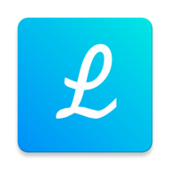

  

<h1 align="center">Leap Launcher</h1>

  A simple and elegant launcher for Android Mobile &amp; TV.

  
  
  

---

## About

Leap Launcher is a clean, lightweight launcher designed for both Android phones and Android TV devices. It focuses on simplicity, speed, and a polished user experience.

## Download

| Source                    | Link                                                                                          |
| ------------------------- | --------------------------------------------------------------------------------------------- |
| **Google Play Store**     | [Download on Google Play](https://play.google.com/store/apps/details?id=com.haztech.launcher) |
| **APK (GitHub Releases)** | [Latest release](https://github.com/HazAnwar/leap-launcher/releases/latest)                   |

> **Note:** APK downloads are available on the [GitHub Releases](https://github.com/HazAnwar/leap-launcher/releases) page. You can find the latest version as well as all previous releases there.

## Support

If you enjoy Leap Launcher and want to support its development, consider buying me a coffee:

## Contributing

Found a bug or have a feature idea? Feel free to [open an issue](https://github.com/HazAnwar/leap-launcher/issues/new/choose). Contributions and feedback are always welcome.
